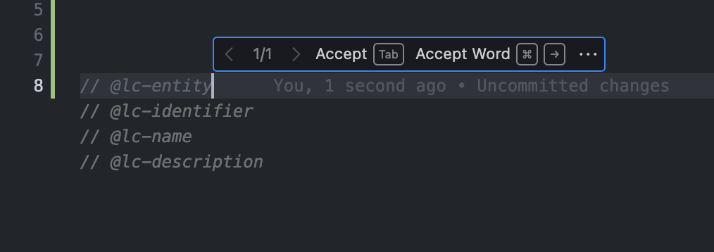

# Bachelor work repository

## Linking software artifacts

The increasing size and complexity of software systems creates the need for
easy navigation and detection of related parts. Finding the use of a component
or a function declaration is now a commonly available functionality. However,
this functionality can be extended by linking at the data semantic level. The
new linking would allow linking data models, specifications, source code in
different languages, documentation, as well as other artifacts of the software
system. The basic idea is to use annotations placed in comments to indicate
significant parts of the artifacts. Annotations can, for example, describe
selected data entities and their properties. This information could then be
used, for example, for code analysis, domain model construction, or assisting
programmers. However, support from software tools is essential for the adoption
of this approach. As part of the thesis, the student will design and implement
proof-of-concept solutions that demonstrate the use of the approach described
above. The solution will include an extension for Visual Studio Code to
facilitate the developer's annotation. Furthermore, the user will be able to
annotate data entities with the solution and then visualize their relationships
across the software system.

## Get started

### Annotations

```typescript
// @lc-entity
// @lc-identifier :Annotation
// @lc-name Annotation
// @lc-description Base class for all annotations.
export interface IAnnotation {
  // @lc-property
  // @lc-name name
  name: string
  // @lc-property
  // @lc-name value
  value: string | null
  // @lc-property
  // @lc-name annotationStartPos
  startPos: number
  // @lc-property
  // @lc-name annotationEndPos
  endPos: number
  // @lc-property
  // @lc-name annotationLine
  lineNumber: number
}
```

By adding annotations to your code, you can define entities and their
properties, which can be later used for visualization and analysis. The
annotations are defined by the `@lc-` prefix, followed by the annotation name.
The annotation name is followed by the annotation value.

> **Note:** You can redefine the prefix and annotation markers in the
> `ei-config.json` file.

### Entity Inspector VScode extension

The extension is used to provide support for annotating the code. It provides:

- **Hint to the user** about existing artifacts with IntelliSense `ctrl+space`
  when your cursor is in the `@lc-`


- Inline-suggest snippets for `@lc-enity` / `@lc-property` / `@lc-method`.



- Inline-suggest user defined source as `@lc-source ...` if exists.


### CLI

The CLI tool is used to parse the code and create an annotations model. The
model is then used to create an entities model, which is used for visualization
and analysis.

```bash
./cli.py parse <path>    # Parse the given path and creates annotations model
./cli.py convert <path>  # Convert the given path to the entities model
./cli.py                # Parses root and converts to entities model
```

### Web application

The web application is used to visualize the entities model. It provides a
hierarchical view of the entities and their properties.

```bash
cd ./webapp
npm install
npm run dev
```


## Development

<details close>
<summary> Details </summary>

## Entity Inspector VScode extension

### Extension installation

```bash
cd ./entity-inspector                     # go to the extension folder
npm install                               # install npm packages
npm run build                             # create vsix package in current folder
```

## Backend for the project (server and CLI)

### Instalation

```bash
python3 -m venv .venv           # create virtual env.
.venv/bin/activate              # Activate venv for Unix
.venv\Scripts\activate          # Activate venv for Windows
pip install -r requirements.txt # install dependencies
```

### Flask sever for Entity Extension

```bash
python3 run.py                            # runs on `http://127.0.0.1:5000`
```

### CLI for Entity Extension

| Command | Description |
| --- | --- |
| `./cli.py --help` | Display help message |
| `./cli.py parse <path>` | Parse the given path and creates annotations model |
| `./cli.py convert <path>` | Convert the given path to the entities model |
| `./cli.py` | parses root and converts to entities model` |

## Configuration

- `ei-config.json` file is used to configure the CLI and extension:

    ```json
    {
        "prefixName": "@lc",
        "identifierMarker": "identifier",
        "nameMarker": "name",
        "typeMarker": "type",
        "descriptionMarker": "description",
        "entityMarker": "entity",
        "propertyMarker": "property",
        "methodMarker": "method",
        "sourceMarker": "source",
        "serverUrl": "http://localhost:5000",
        "annotationsModel": "annotations.json",
        "entitiesModel": "entities.json",
        "parserExclude": ["node_modules", ".git", ".venv"],
        "parserInclude": ["entity-inspector"]
    }
    ```

## Web application

Application for ei-models vizualzation. **All commands are executed in the `webapp` folder**

### Project Setup

```sh
npm install
```

#### Compile and Hot-Reload for Development

```sh
npm run dev
```

#### Compile and Minify for Production

```sh
npm run build
```

</details>
