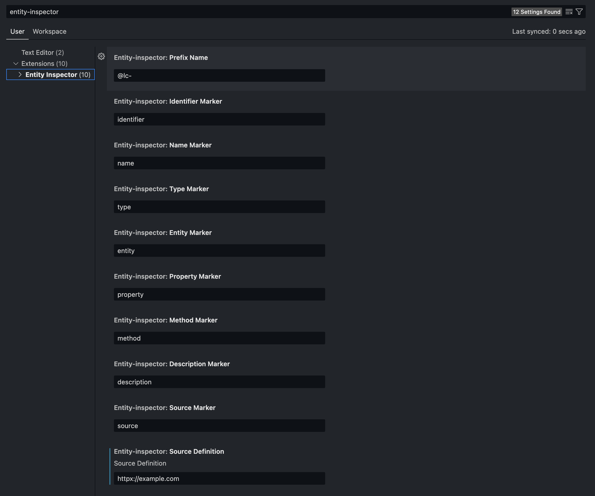

# Entity-Inspector

It is the plugin for VS Code that provides the ability to analyze the structure of the code and extract information about objects and entities used in the project.

The plugin can scan the source code for the presence of classes, functions, variables, modules, packages and other entities, and then represent the objects found in the form of a hierarchical structure that allows you to quickly find the desired object.

Users can use Entity-Inspector to quickly find definitions and uses of objects, as well as to debug code. The plugin makes it easier to work with large projects, where a lot of objects can be confusing and difficult to track.

## How to install

```bash
$ git clone git@github.com:MarkSeliverstov/MFF-YearProject.git    # clone the repository
$ cd MFF-BACHELOR-WORK/entity-inspector                           # go to the extension folder
$ npm install                                                     # install npm packages
$ npm run build                                                   # create vsix package in current folder
```

After that, you can install the extension in VS Code by opening the command palette `ctrl+shift+p` and typing `Extensions: Install from VSIX...` and selecting the generated vsix file. 

Then you can use it like a normal extension from the marketplace.

- In the `examples folder`, you can find examples of code that can be analyzed by the extension.

**Enjoy!**

## Release Notes

### 0.0.1

- The extension can **hint to the user** about existing artifacts with IntelliSense `ctrl+space` when your cursor is in the `@lc-`
    
- Extension can inline-suggest snippets for `@lc-enity` / `@lc-property` / `@lc-method`.
    
- Extension can inline-suggest user defined source as `@lc-source ...` if exists.
    
    
- Also you can add your definition of markers (`@lc-`, `entity`, `property`, ...).
    
