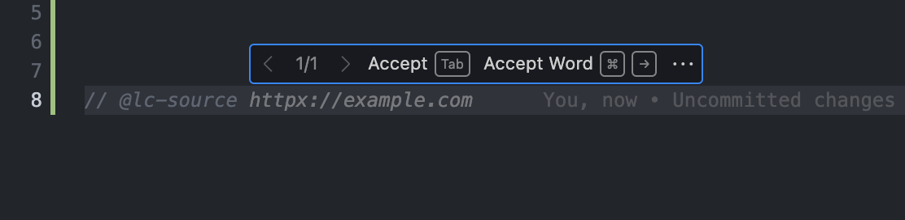
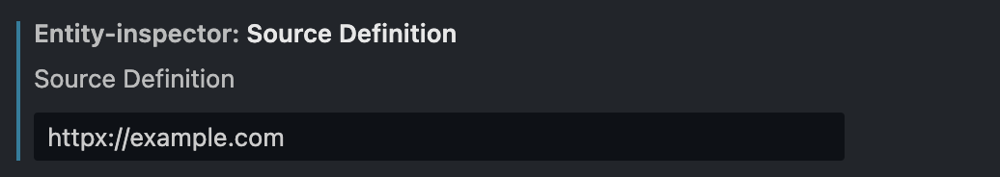

## Release Notes

### 0.0.1

- The extension can **hint to the user** about existing artifacts with IntelliSense `ctrl+space` when your cursor is in the `@lc-`
    
- Extension can inline-suggest snippets for `@lc-enity` / `@lc-property` / `@lc-method`.
    
- Extension can inline-suggest user defined source as `@lc-source ...` if exists.
    
    
