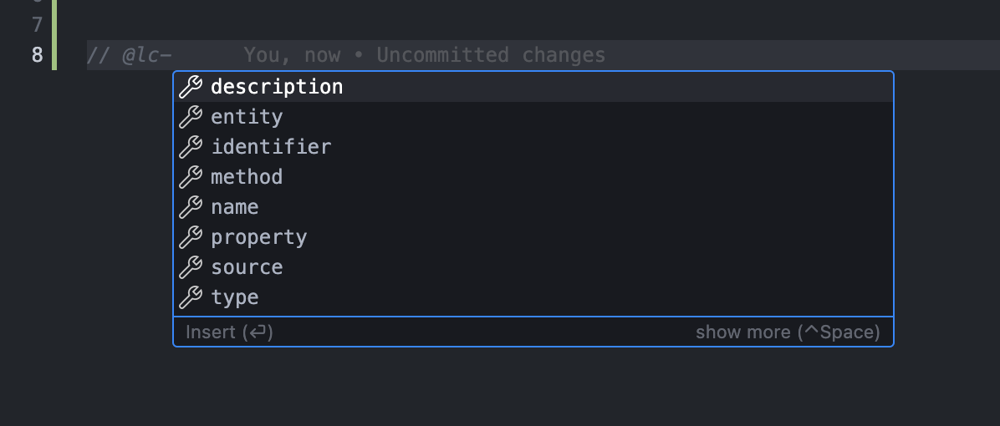
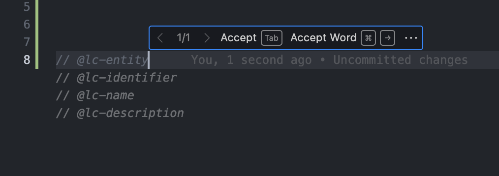
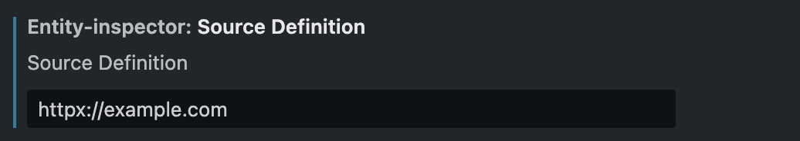
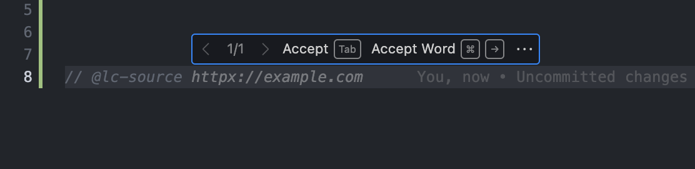

# LSA Helper

[](https://marketplace.visualstudio.com/items?itemName=lsa.lsa-helper)

This plugin for VS Code is a part of the LSA (Linking software artifacts)
project. The plugin provides a way to help developers write code artifacts to
define entities and their properties.

The extension is used to provide support for annotating the code. It provides:

- **Hint to the user** about existing artifacts with IntelliSense `ctrl+space`
  when your cursor is after the `prefix`(default: `@lc-`).



- Inline-suggest snippets for `@lc-enity` / `@lc-property` / `@lc-method`.



<!-- - Inline-suggest user defined source as `@lc-source ...` if exists. -->
<!---->
<!--  -->
<!--  -->

## Configuration

Default configuration file is `.lsa-config.json` in the current working directory.
You can specify the path to the configuration file in the settings.

If the file is not found, default configuration is used:

```json
{
  "markers": {
    "prefix": "@lc-",
    "identifier": "identifier",
    "name": "name",
    "type": "type",
    "description": "description",
    "entity": "entity",
    "property": "property",
    "method": "method",
    "source": "source"
  }
}
```

#### markers

In the `markers` section you can specify the names of the fields that are used
in the annotations.

**Example:**

```python
# @lc-entity
# @lc-identifier :Annotation
# @lc-name Annotation
# @lc-description Base class for all annotations.
class Annotation:
    # @lc-property
    # @lc-name name
    name: str
    # @lc-property
    # @lc-name value
    value: str | None
```
